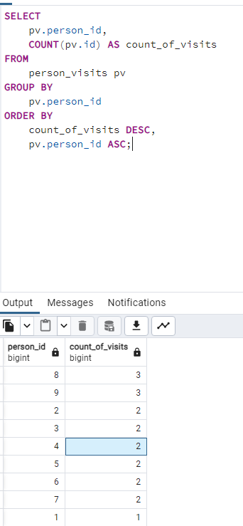
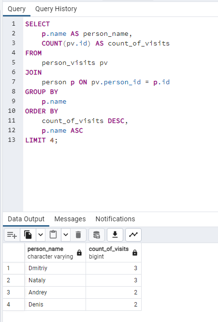
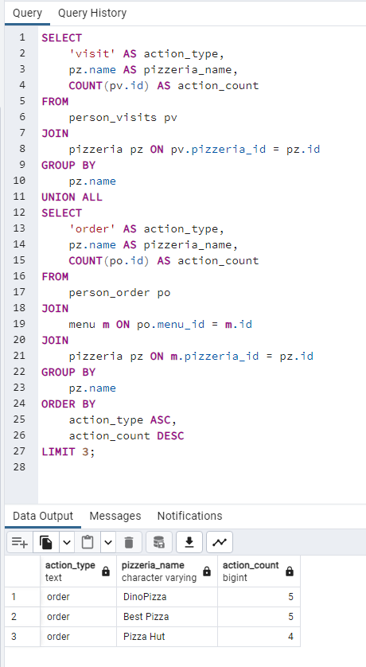
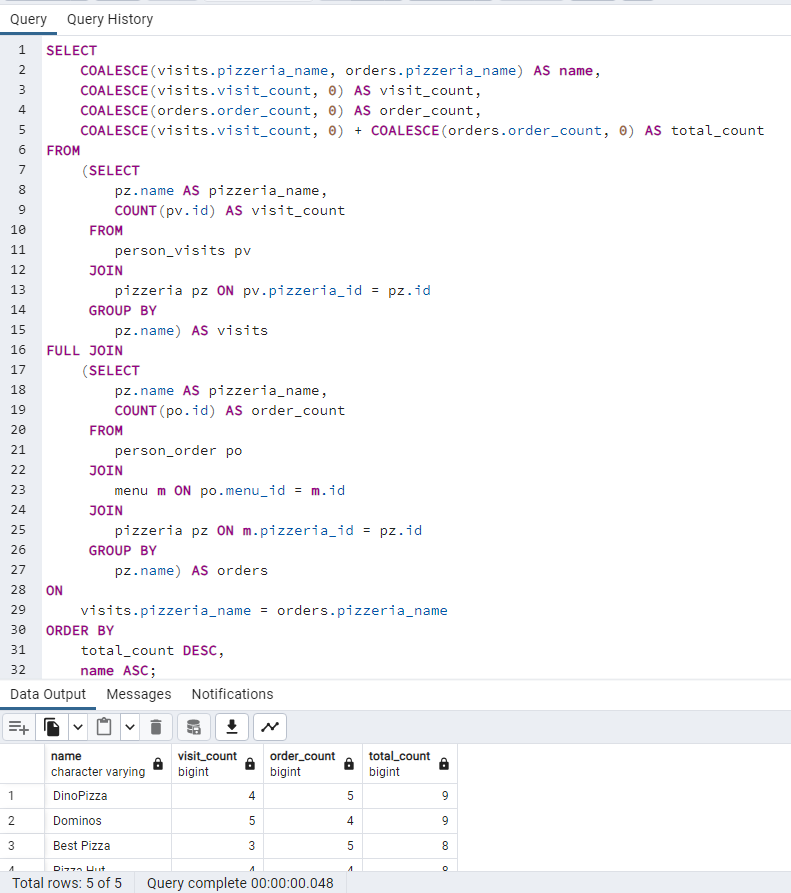
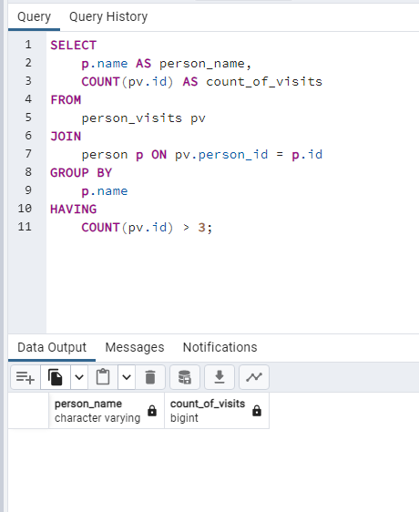
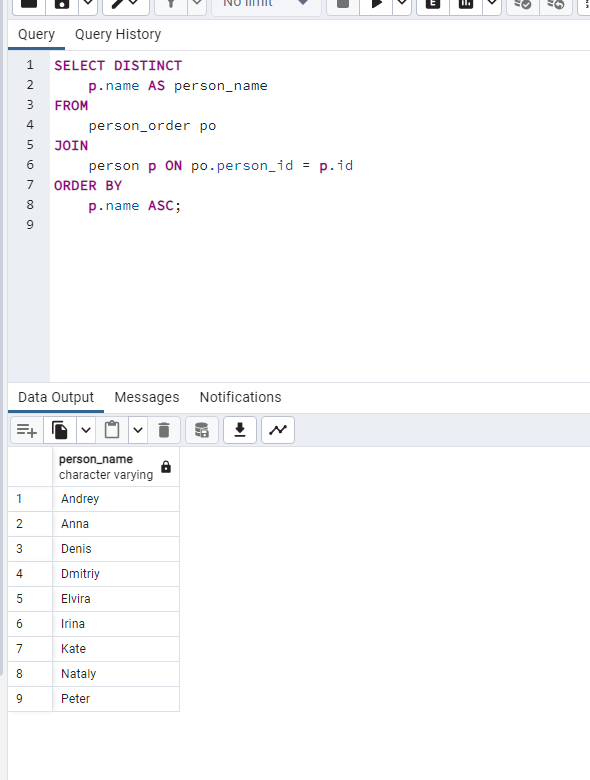
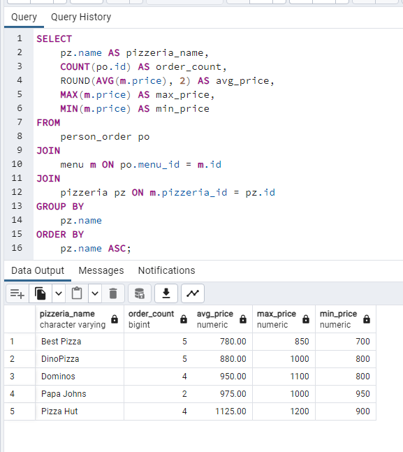
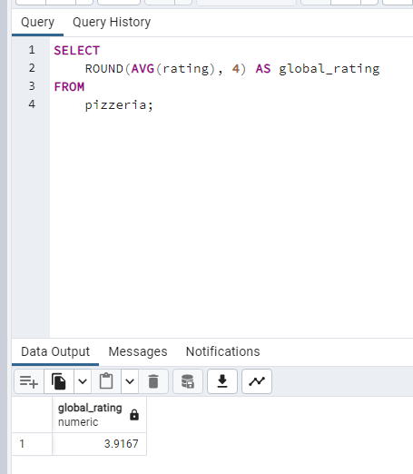

## Exercise 00 - Simple aggregated information

## Exercise 01 - Let’s see real names

## Exercise 02 - Restaurants statistics

## Exercise 03 - Restaurants statistics #2

## Exercise 04 - Clause for groups

## Exercise 05 - Person's uniqueness

## Exercise 06 - Restaurant metrics

## Exercise 07 - Average global rating

## Exercise 08 - Find pizzeria’s restaurant locations